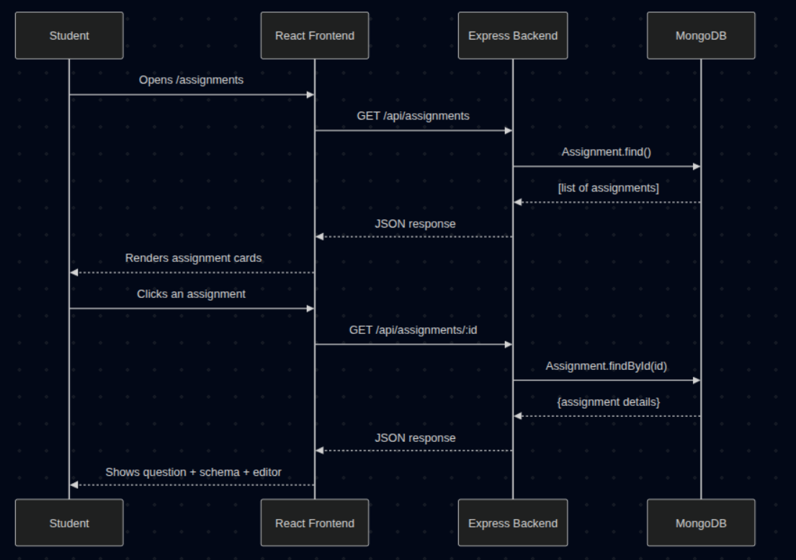
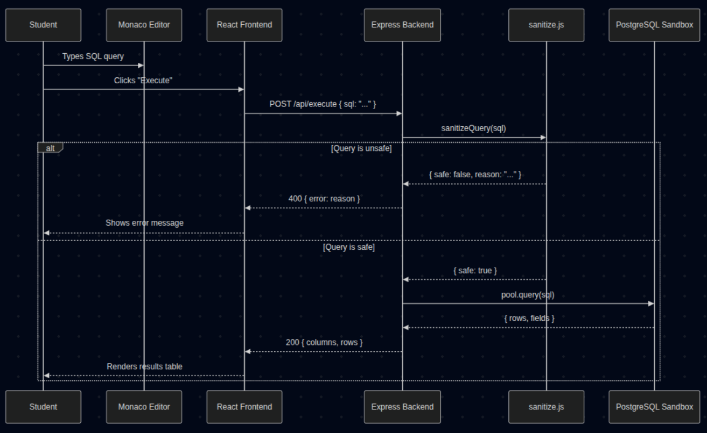
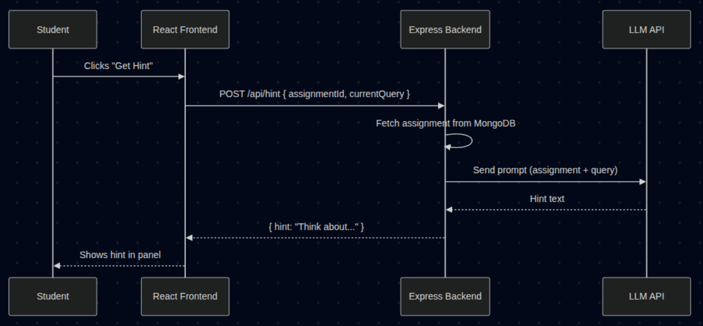

# CipherSQLStudio

A browser-based SQL learning platform where students practice SQL by solving assignments, writing queries, and getting AI-powered hints.

## Tech Stack

| Layer | Technology |
|-------|-----------|
| Frontend | React, Vanilla SCSS, Monaco Editor |
| Backend | Node.js, Express.js |
| Databases | PostgreSQL (sandbox), MongoDB (for storing assignments) |
| AI | Google Gemini API |

## Features

- Browse SQL assignments by difficulty (easy, medium, hard)
- Write SQL queries in a VS Code-like editor (Monaco)
- Execute queries against a sandboxed PostgreSQL database
- Get AI-powered hints
- Defense-in-depth query sanitization (app-level + DB-level)

---

## Project Structure

```
sql-studio/
├── client/                 # React frontend (Vite)
│   └── src/
│       ├── components/     # Navbar, QueryEditor
│       ├── pages/          # HomePage, AssignmentPage
│       ├── services/       # API call functions
│       └── styles/         # SCSS (variables, mixins, main)
├── server/                 # Express backend
│   ├── config/             # MongoDB + PostgreSQL connection
│   ├── models/             # Mongoose models
│   ├── routes/             # API routes (assignments, execute, hint)
│   ├── middleware/         # SQL sanitizer
│   └── services/           # Sandbox runner, Gemini wrapper
├── seed/                   # Database seed scripts
└── README.md
```

---

## Local Setup (Step by Step)

### Prerequisites

Make sure you have these installed before starting:

| Tool | Version | Check command |
|------|---------|--------------|
| Node.js | v18+ | `node --version` |
| npm | v9+ | `npm --version` |
| PostgreSQL | 14+ | `psql --version` |
| MongoDB | 6+ | `mongosh --version` |
| Git | any | `git --version` |

You also need a **Google Gemini API key**. Get one free at [https://aistudio.google.com/apikey](https://aistudio.google.com/apikey).

---

### Step 1: Clone the Repository

```bash
git clone https://github.com/anuragparashar26/sql-studio.git
cd sql-studio
```

---

### Step 2: Install Dependencies

```bash
# Backend
cd server
npm install

# Seed scripts
cd ../seed
npm install

# Frontend
cd ../client
npm install

cd ..
```

---

### Step 3: Set Up PostgreSQL

Run these in terminal:

```bash
sudo -u postgres createdb sql_sandbox
sudo -u postgres psql -d sql_sandbox -f seed/seedSandbox.sql
sudo -u postgres psql
```

Run these in psql:

```sql
-- Create restricted user
CREATE USER sandbox_reader WITH PASSWORD 'your_secure_password';

-- Allow connection to database
GRANT CONNECT ON DATABASE sql_sandbox TO sandbox_reader;

-- Switch to the sandbox database
\c sql_sandbox

-- Allow schema usage
GRANT USAGE ON SCHEMA public TO sandbox_reader;

-- Allow read-only access to existing tables
GRANT SELECT ON ALL TABLES IN SCHEMA public TO sandbox_reader;

-- Automatically grant SELECT on future tables
ALTER DEFAULT PRIVILEGES FOR ROLE postgres
IN SCHEMA public
GRANT SELECT ON TABLES TO sandbox_reader;

-- Exit psql
\q
```


### Step 4: Set Up and Start MongoDB

```bash
sudo systemctl start mongod

#### 4b. Verify MongoDB Is Running

```bash
mongosh --eval "db.runCommand({ ping: 1 })"
```

You should see `{ ok: 1 }`.

---

### Step 5: Configure Environment Variables

```bash
cp server/.env.example server/.env
```

Open `server/.env` in your editor and fill in your values:

```env
# MongoDB
MONGO_URI=mongodb://localhost:27017/sqlstudio

# PostgreSQL Sandbox
PG_HOST=localhost
PG_PORT=5432
PG_DATABASE=sql_sandbox
PG_USER=sandbox_reader
PG_PASSWORD=your_secure_password    # the password you set in Step 

# Google Gemini API
GEMINI_API_KEY=your_gemini_api_key
GEMINI_MODEL=gemini-1.5-flash

# Server
PORT=5000
```

---

### Step 6: Seed MongoDB with Assignments

```bash
cd server
npm run seed
```

You should see:

```
Connected to MongoDB
Cleared existing assignments
Inserted 6 assignments
Done!
```

---

### Step 7: Start the App

Open **two terminals**:

**Terminal 1 — Backend:**
```bash
cd server
npm run dev
```

Expected output:
```
MongoDB connected
Server running on http://localhost:5000
```

**Terminal 2 — Frontend:**
```bash
cd client
npm run dev
```

---

## Architecture

### 1. Viewing an Assignment



### 2. Executing a Query



### 3. Getting a Hint from LLM




**Query safety** uses defense in depth:
1. **App-level sanitizer** — blocks non-SELECT statements, multi-statements, comments
2. **PostgreSQL read-only role** — only SELECT permission granted
3. **Statement timeout** — 5 second limit per query

---
